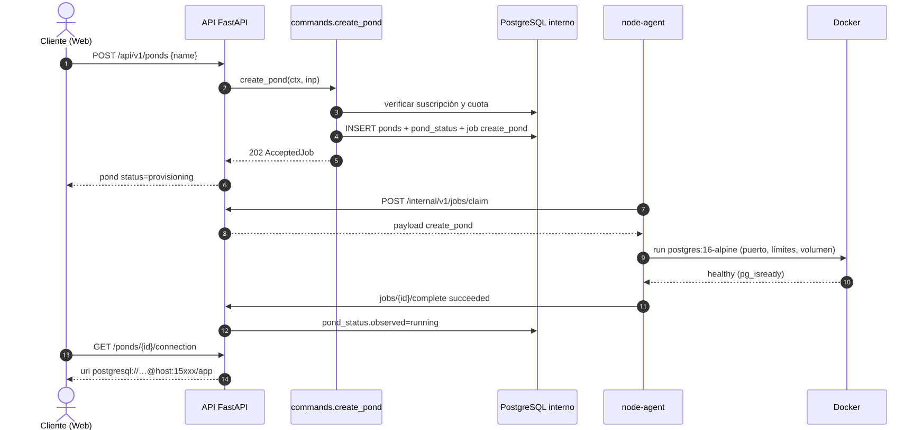
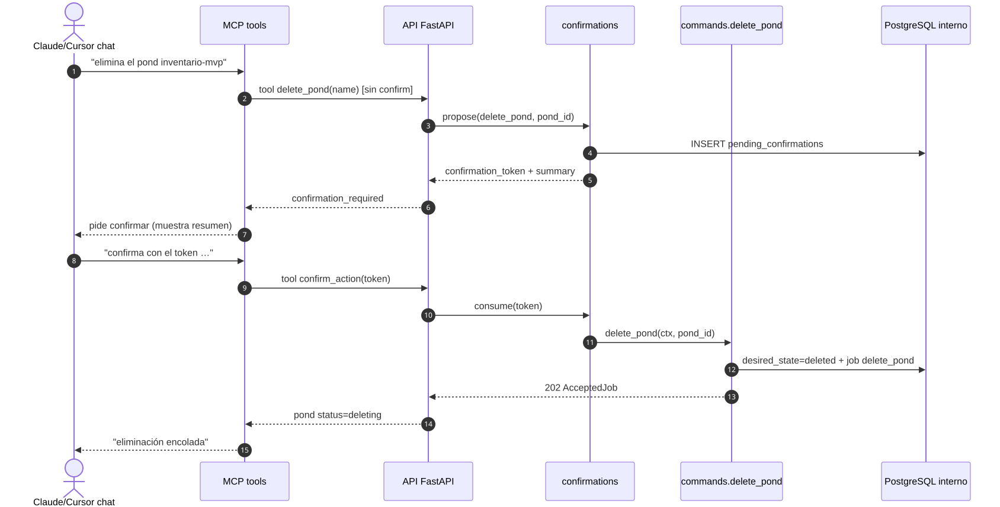

# KoiCloud — Entrega 2: Requisitos y diseño preliminar

**Curso:** Ingeniería de Software I · Universidad Rafael Landívar · 2026  
**Categoría:** Base de Datos como Servicio (DBaaS)  
**Fecha del hito:** 11 de septiembre de 2026  
**Equipo KoiCloud:** Hugo Escobar, Jason Gutiérrez, Jousé Menendez, Diego Joachin  
**Documento:** requisitos + diseño alineados al alcance sellado

---

## 1. Introducción

KoiCloud es una plataforma DBaaS que permite a un desarrollador registrarse, contratar un plan con pago simulado y obtener una instancia PostgreSQL gestionada (un *pond*) sin operar el servidor. Las superficies comprometidas son **Web**, **CLI** y **MCP**, todas como clientes delgados de la misma API de control plane.

Este documento responde al hito de *requisitos y diseño preliminar* del enunciado del curso: alcance, requisitos, casos de uso, arquitectura, diagramas UML, modelo entidad-relación y mockups con campos de salida.

### 1.1 Respuesta al feedback del catedrático

| Observación | Decisión en este documento |
|---|---|
| Duda sobre auto-curación | Queda **fuera de alcance** como garantía de producto / demo de caos. |
| Duda sobre acceso por agentes / web+CLI+MCP | Se **incluyen** Web + CLI + MCP como **adaptadores delgados** sobre la misma API (no plataforma agéntica). Mutaciones CLI/MCP con **doble confirmación**. Auth de agente = gate mínima de aula; seguridad completa = **V2**. |
| Catálogo y features aprobados | Se mantienen planes Sandbox/Micro/Pro y el flujo DBaaS (crear, estado, conexión). |
| No dividir núcleo / deseable / ambicioso | Una sola lista de compromiso + sección explícita *Fuera de alcance*. |
| Hipótesis de precio / pago local | Declaradas como hipótesis; no son objetivos verificables sin usuarios reales. |
| Arquitectura acorde al conocimiento del equipo | Stack conocido: FastAPI, React, Docker, PostgreSQL; un nodo; sin brokers ni orquestadores. |

El detalle normativo del alcance está en [`alcance.md`](./alcance.md).

---

## 2. Alcance

### 2.1 Compromiso (única lista)

1. Auth completa (registro, verificación, recuperación, JWT+refresh) con roles Cliente y Administrador.  
2. Catálogo de planes, contratación con pago simulado, historial, renovación y cancelación.  
3. Provisioning real de PostgreSQL 16 en Docker; consultar estado; entregar cadena de conexión; eliminar.  
4. Consola SQL en el navegador (lectura por defecto).  
5. Respaldos diarios y restauración bajo demanda.  
6. Vista simple de uso (horas y almacenamiento).  
7. Panel de administración de usuarios, suscripciones e instancias.  
8. Arquitectura control plane / node-agent / cola en PostgreSQL, un solo VPS.  
9. **Web + CLI + MCP** como fachadas delgadas sobre la misma API.  
10. **Doble confirmación** (propose → confirm con token) en acciones mutantes/destructivas desde CLI y MCP.  
11. **Auth mínima de agente:** URL + password / secreto compartido (demo de aula).  
12. **Demo MCP fiable:** guion happy-path + fallback si el LLM en vivo falla.

### 2.2 Fuera de alcance

IaC declarativa (`cloud.yaml`/`apply`), seguridad completa de agentes (**V2**: OAuth, scopes, spend caps, auditoría, 2FA), auto-curación como producto, validación empírica de precio/NIT, otros motores, branching/réplicas/pooler, organizaciones, cobro real, HA/multi-nodo, roles Soporte/Operador, status page, sandbox público sin registro.

### 2.3 Problemas del semestre (verificables)

| ID | Problema | Verificación |
|---|---|---|
| P1 | Crear Postgres gestionado sin ops | URI utilizable tras crear pond |
| P2 | Estado del servicio opaco | Panel / CLI / MCP muestran `status` |
| P3 | Suscripción/pago académico | Flujo simulado + historial |
| P4 | Consultar sin cliente SQL | Consola web / tool MCP devuelve filas |
| P5 | Mutación segura desde agente/CLI | Propose → confirm token → efecto |

---

## 3. Requisitos funcionales

### 3.1 Cuentas

| ID | Requisito |
|---|---|
| RF-01 | Registro con correo y contraseña |
| RF-02 | Verificación de correo por enlace de un solo uso (24 h) |
| RF-03 | Recuperación de contraseña por token temporal |
| RF-04 | Autenticación con JWT de acceso + refresh token |
| RF-05 | Roles Cliente y Administrador con permisos distintos |
| RF-06 | Edición de perfil (nombre, NIT opcional) |

### 3.2 Suscripciones y pagos

| ID | Requisito |
|---|---|
| RF-07 | Catálogo público de planes con nombre, descripción, precio y vigencia |
| RF-08 | Contratación con pago simulado |
| RF-09 | Historial de pagos y descarga de factura PDF (IVA desglosado) |
| RF-10 | Renovación automática al cierre de período y cancelación por el usuario |

### 3.3 Catálogo DBaaS

| ID | Requisito |
|---|---|
| RF-11 | Crear pond PostgreSQL 16 indicando nombre (plan heredado de la suscripción) |
| RF-12 | Consultar estado derivado (provisioning, running, stopped, failed, …) |
| RF-13 | Obtener host, puerto, usuario, contraseña y URI |
| RF-14 | Eliminar pond con confirmación del nombre (web) / doble confirmación (CLI/MCP) |
| RF-15 | Respaldos diarios y restauración bajo demanda |
| RF-16 | Ejecutar SQL desde el navegador (read por defecto; write opcional) |
| RF-17 | Ver uso del mes: horas de instancia y almacenamiento |

### 3.4 Administración

| ID | Requisito |
|---|---|
| RF-18 | Administrador lista usuarios, suscripciones y ponds |
| RF-19 | Administrador puede suspender un usuario |

### 3.5 Superficies CLI y MCP

| ID | Requisito |
|---|---|
| RF-20 | CLI `koicloud`: login, list/create/get/delete ponds, connection, SQL read; llama solo a `/api/v1` |
| RF-21 | Servidor MCP: tools equivalentes (list/create/delete ponds, SQL, …) delegando a la capa de comandos |
| RF-22 | Mutaciones CLI/MCP: primer paso devuelve `confirmation_token`; segundo paso lo consume y ejecuta |
| RF-23 | Gate de acceso agente: URL + password/secreto compartido revelable en el panel web |
| RF-24 | Guion de demo MCP documentado + modo fallback sin LLM en vivo |

---

## 4. Requisitos no funcionales (medibles y honestos)

| ID | Requisito | Verificación |
|---|---|---|
| RNF-01 | API p95 &lt; 500 ms con 20 usuarios concurrentes en el VPS de demo | k6 o equivalente |
| RNF-02 | Provisioning p95 &lt; 90 s hasta URI utilizable | Instrumentación en control plane |
| RNF-03 | Contraseñas de usuario con argon2; secretos de pond cifrados en reposo | Revisión de código |
| RNF-04 | Cada pond con límites de CPU/memoria (cgroups) | `docker inspect` |
| RNF-05 | UI usable desde 360 px; Chrome y Firefox actuales | Prueba manual |
| RNF-06 | OpenAPI autogenerado en `/docs` | Navegación |
| RNF-07 | CLI y MCP no duplican reglas de negocio (solo transportan) | Revisión: llaman commands/API |
| RNF-08 | Demo MCP reproducible vía guion/fallback en ≤ 10 min de preparación | Ensayo previo a exposición |

*No se declara RNF de auto-curación ni de seguridad de agentes de nivel producción.*

---

## 5. Casos de uso

Actores: **Visitante**, **Cliente**, **Administrador**, **Agente MCP** (cliente técnico autenticado con gate mínima), **Usuario CLI** (mismo Cliente vía token).

Diagrama fuente: [`diagramas/03-casos-de-uso.mmd`](./diagramas/03-casos-de-uso.mmd) · render: [`renders/03-casos-de-uso.svg`](./renders/03-casos-de-uso.svg)

### CU-01 Crear pond (resumen)

1. Cliente autenticado con suscripción activa elige “Crear pond” (web) o equivalente CLI/MCP.  
2. Ingresa nombre; el sistema valida cuota del plan.  
3. Control plane escribe estado deseado `running` y encola job `create_pond`.  
4. Node-agent reclama el job, crea el contenedor y reporta `running`.  
5. Cliente consulta conexión y recibe URI.

Excepciones: sin suscripción → `plan_required`; cuota llena → `quota_exceeded`; sin nodo → `node_unavailable`.

### CU-MCP Mutación con doble confirmación (resumen)

1. Agente MCP propone `delete_pond` (o create / SQL write).  
2. API responde `confirmation_required` + `confirmation_token` + resumen de la acción.  
3. Agente (o usuario en el chat) confirma enviando el token.  
4. Solo entonces se ejecuta el comando y se encola el job si aplica.

---

## 6. Arquitectura

### 6.1 Decisión

Monolito modular FastAPI (**control plane**) que **nunca ejecuta Docker**. Un **node-agent** en el VPS reclama trabajos, opera contenedores y reporta estado. El estado vive en PostgreSQL (deseado, observado, cola). **Web, CLI y MCP** son fachadas: HTTP JSON / tools MCP → misma capa de comandos.

**Por qué no microservicios:** un ciclo de despliegue unificado y transacciones compartidas entre auth/billing/ponds.  
**Por qué no Kubernetes:** el curso evalúa entender el provisioning; K8s lo ocultaría y añadiría operación que no aporta al aprendizaje del hito.  
**Por qué cola en PostgreSQL:** evita un broker extra; `FOR UPDATE SKIP LOCKED` basta para decenas de jobs/minuto.  
**Por qué CLI/MCP thin:** una sola fuente de verdad de reglas; el “wow” de NL no requiere duplicar dominio.

### 6.2 Diagrama de componentes

Fuente: [`diagramas/01-arquitectura-componentes.mmd`](./diagramas/01-arquitectura-componentes.mmd)



### 6.3 Despliegue

Fuente: [`diagramas/02-despliegue.mmd`](./diagramas/02-despliegue.mmd)



Un dominio, Caddy como proxy (`/`, `/api/*`, `/mcp`), API/worker/db en Compose, node-agent con acceso al socket Docker, ponds en puertos 15000–15999.

### 6.4 Secuencia de provisioning

Fuente: [`diagramas/04-secuencia-provisioning.mmd`](./diagramas/04-secuencia-provisioning.mmd)



### 6.5 Secuencia MCP — mutación con confirmación

Fuente: [`diagramas/07-secuencia-mcp-confirm.mmd`](./diagramas/07-secuencia-mcp-confirm.mmd)



### 6.6 Diagrama de clases (dominio)

Fuente: [`diagramas/05-clases-dominio.mmd`](./diagramas/05-clases-dominio.mmd)



Incluye `AgentAccess` mínimo (gate de demo). Sin OAuth, scopes ni sistema de auditoría.

---

## 7. Modelo entidad-relación y diseño de BD

Fuente: [`diagramas/06-modelo-er.mmd`](./diagramas/06-modelo-er.mmd)



### Tablas principales

| Área | Tablas |
|---|---|
| Cuentas | `users`, `email_tokens`, `refresh_tokens` |
| Dinero | `plans`, `subscriptions`, `payments`, `invoices`, `invoice_lines` |
| Plataforma | `nodes`, `ponds`, `pond_status`, `jobs`, `backups` |
| Medición / SQL | `pond_samples`, `usage_daily`, `sql_history` |
| Agente (mínimo) | `agent_access` (password/hash de gate + URL slug; opcional `pending_confirmations`) |

Separación clave: `ponds` = estado **deseado**; `pond_status` = estado **observado**. Los jobs se procesan con `SKIP LOCKED`.

Planes semilla: `sandbox` (USD 0, vigencia 10 min), `micro` (USD 5/mes), `pro` (post-pago por hora).

---

## 8. Stack tecnológico

| Capa | Tecnología |
|---|---|
| Frontend | React + Vite + TypeScript |
| CLI | Typer + httpx (thin client) |
| MCP | FastMCP montado en el proceso API |
| Backend | Python 3.12 + FastAPI + SQLAlchemy + Alembic |
| BD interna | PostgreSQL 16 |
| Data plane | Python + Docker SDK (modo `docker` \| `mock`) |
| Motor ofrecido | `postgres:16-alpine` |
| Auth usuario | JWT + refresh; argon2 |
| Auth agente | Password / shared secret (gate) |
| Proxy | Caddy |
| CI | GitHub Actions (cuando el repo esté activo) |

---

## 9. Mockups

Mockups HTML editables (pantallas + **campos de salida**):  
[`mockups/pantallas-principales.html`](./mockups/pantallas-principales.html)

| Pantalla | Salida destacada |
|---|---|
| Registro | `user.id`, `email_verified=false`, aviso de enlace |
| Planes / contratar | `subscription`, `payment`, `invoice.number` |
| Dashboard | lista `PondOut.status`, host:puerto |
| Crear pond | `202` + `job_id` + `status=provisioning` |
| Detalle | `PondConnectionOut` (host, port, uri, …) |
| Consola SQL | `columns`, `rows`, `row_count`, `duration_ms` |
| Uso | `instance_hours`, `storage_gb_month` |
| Admin | `AdminUserOut` |
| Acceso agente | URL MCP + password revelable |
| Confirmación mutación | `confirmation_token`, resumen, segundo paso |

Capturas PNG de referencia (si se generaron): carpeta [`renders/mockups/`](./renders/mockups/).

---

## 10. Trazabilidad diagrama ↔ compromiso

| Artefacto | Compromiso que cubre |
|---|---|
| Arquitectura / despliegue | Ítems 8–9 |
| Casos de uso | Ítems 1–12 |
| Secuencia provisioning | Ítem 3 |
| Secuencia MCP confirm | Ítems 10–11 |
| Clases + ER | Persistencia de 1–11 |
| Mockups | UX de 1–11 + gate/confirm |

---

## 11. Decisiones de arquitectura (resumen defendible)

1. **Control plane ≠ Docker** — el request HTTP no bloquea creando contenedores.  
2. **Cola en PostgreSQL** — una dependencia menos que Kafka/RabbitMQ.  
3. **Un solo nodo** — suficiente para el semestre; multi-nodo explícitamente fuera.  
4. **Driver mock del agente** — desarrollo y demo de respaldo sin VPS.  
5. **Tres fachadas, una API** — Web/CLI/MCP sin duplicar reglas; doble confirmación en mutaciones remotas.  
6. **Auth de agente mínima** — demo de aula; seguridad completa aplazada a V2.

---

## Anexo A — Cómo regenerar renders

```bash
cd docs/entrega-2
npx -y @mermaid-js/mermaid-cli@11 -i diagramas/01-arquitectura-componentes.mmd -o renders/01-arquitectura-componentes.svg
# repetir para 02…07; también -e png
```

## Anexo B — Archivos del paquete

```
docs/entrega-2/
  README.md
  alcance.md
  ENTREGA-2.md          ← este documento
  diagramas/*.mmd
  mockups/pantallas-principales.html
  renders/*.svg|*.png
```
